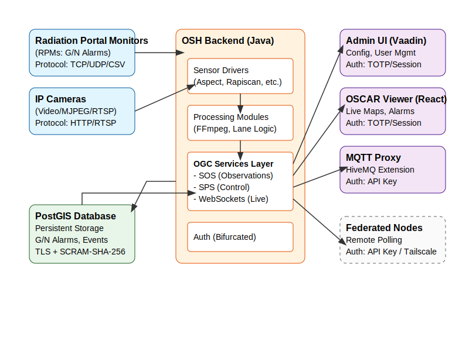

# OSCAR System Architecture

## Overview
OSCAR (Open Source Central Alarm Station) is a monitoring system for radiation portal monitors based on the OpenSensorHub (OSH) framework.

## Data Flow Diagram

## Component Network Flow and Ports

### Components:
- **OSH Backend**: Java-based core application.
- **PostGIS Database**: PostgreSQL with PostGIS extensions for persistent storage.
- **Client Web UI**: React/Frontend viewer.

### Default Port Configuration:
- **OSH Backend API (HTTP)**: `8282`
- **OSH Backend Admin UI**: `8282`
- **PostGIS Database**: `5432`
- **MQTT Server (HiveMQ)**: WebSockets on `/mqtt` (via proxy on port `8282`)

### Network Flows:
- **Client to OSH**: Clients interact with OSH through its REST API and Web UI on port `8282`. The client is now progressive web app (PWA) compatible and can be installed locally via a modern web browser.
- **Client Features**: The progressive web application contains specialized functionality such as offline caching, client-side WebID analysis, and camera integration for Spectroscopic QR Code scanning during Adjudication workflows.
- **OSH to PostGIS**: The OSH backend connects to the PostGIS database over the network (local or LAN) on port `5432`. This connection is secured via TLS and authenticated with SCRAM-SHA-256.
- **Certificate Management**: OSH manages its own internal PKI. On first boot, a 20-year Root CA and a 1-year Leaf certificate are generated and stored in `osh-keystore.p12`. The system automatically renews the Leaf certificate if it is within 30 days of expiration during the boot sequence.

## Deployment and Lifecycle Commands

### Main Launch Scripts:
Located in `dist/release/`:
- `launch-all.sh`: Starts the PostGIS container and the OSH backend (Linux/macOS).
- `launch-all-arm.sh`: Starts the PostGIS container and the OSH backend (ARM64, e.g., Mac M1/M2/M3).
- `launch-all.bat`: Starts the PostGIS container and the OSH backend (Windows).

### Automated Provisioning Utilities:
Located in the repository root:
- `provision-node.sh`: Securely pushes an API key to a remote node via Tailscale (Unix/Linux/macOS).
- `provision-node.bat`: Securely pushes an API key to a remote node via Tailscale (Windows).

See [Federation Provisioning](docs/FEDERATION_PROVISIONING.md) and [Tailscale Configuration](docs/TAILSCALE_CONFIGURATION.md) for detailed setup and usage instructions.

### Standalone Database Scripts:
Located in `dist/release/postgis/`:
- `run-postgis.sh`: Starts the PostGIS container independently (Linux/macOS).
- `run-postgis-arm.sh`: Starts the PostGIS container independently (ARM64).
- `run-postgis.bat`: Starts the PostGIS container independently (Windows).

## Database Utilities
Cross-platform scripts are provided in the repository root for maintenance:
- `backup.sh/bat`: Safely creates a database dump.
- `restore.sh/bat`: Restores the database from a dump.

These utilities respect the `DB_HOST` and `POSTGRES_PASSWORD_FILE` environment variables.
