<table>
<colgroup>
<col style="width: 100%" />
</colgroup>
<thead>
<tr class="header">
<th>
<strong>TECHNICAL HANDBOOK</strong>

<strong>OSCAR System Documentation</strong>

Architecture, deployment, configuration, operations, and roadmap guide
</th>
</tr>
</thead>
<tbody>
</tbody>
</table>

| **Field**       | **Value**                                                                                                                                           |
|-----------------|-----------------------------------------------------------------------------------------------------------------------------------------------------|
| Document type   | Technical reference and operations guide                                                                                                            |
| Baseline        | OSCAR v3.3.2 / 3.5 pause-point feature line                                                                                                         |
| Version context | Centered on v3.3.2, the feature-complete build expected to become the 3.5 pause point after an internal test cycle                                  |
| Audience        | Deployment engineers, operators, testers, and maintainers                                                                                           |
| Scope           | Administrative configuration, viewer/PWA, database, file handling, Web ID integration, offline conversion, reporting, scaling, and upgrade guidance |

<table>
<colgroup>
<col style="width: 100%" />
</colgroup>
<thead>
<tr class="header">
<th>
Release validation

Validate release-specific details such as default credentials, exact filenames, and whether an item is shipped behavior or planned future work against the packaged release. This handbook is a practical system manual for the covered release line, not a substitute for version-specific release notes.
</th>
</tr>
</thead>
<tbody>
</tbody>
</table>

# 1. Executive summary

OSCAR is a configurable monitoring and analysis platform organized around sites, nodes, lanes, events, and evidence. The system couples a service and administration console with a live viewer/PWA so that operators can configure lanes, watch events, review spectra and video, collect adjudication evidence, and generate site or event reports from the same deployment.

OSCAR runs with PostgreSQL database and supports automatic lane creation from CSV, map overlays, HTTPS hosting, mobile notifications, role-based file access, automated Web ID analysis for RS350 alarms, manual evidence uploads, offline file conversion through Cambio, and report generation backed by a shared file store.

Operationally, OSCAR supports two practical deployment patterns: a default single-machine installation for smaller sites and a split installation for higher scale, where PostgreSQL moves to a dedicated database server while the application host retains the file store, videos, reports, and viewer. The product roadmap also includes migration scripts, a stronger deployment security posture, broader internationalization, better raw evidence export, and several user-interface improvements.

## System snapshot

| **Area**           | **Summary**                                                                                                                                                                 |
|--------------------|-----------------------------------------------------------------------------------------------------------------------------------------------------------------------------|
| Primary purpose    | Lane-oriented monitoring and adjudication platform that combines radiation data, camera feeds, event review, evidence collection, reporting, and operational notifications. |
| Core interfaces    | An admin/service configuration surface for setup plus a browser viewer that can also be installed as a progressive web app on desktop or mobile devices.                    |
| Persistence        | PostgreSQL is the primary database. The default deployment runs it in Docker on the same machine; larger sites can move it to a dedicated host.                             |
| Evidence model     | Events can combine spectra, N42 files, uploaded evidence, QR code data, videos, Web ID results, adjudication history, and generated reports.                                |
| Major integrations | Rapiscan, Aspect, and RSI lanes, FFmpeg-recognized camera streams, Web ID, Cambio, MQTT, and a role-aware file API.                                                         |

# 2. System architecture

OSCAR is best understood as a node-centric application host that serves both configuration and operator workflows while coordinating external devices and services. Lanes are the operational units. Each lane can have detector inputs, camera feeds, event history, and associated evidence. Events and statistics are persisted in PostgreSQL, while files such as videos, reports, site diagrams, CSV imports, and adjudication artifacts remain on the application host file system.

The diagram below condenses the system relationships. It is not a source-code class diagram; instead, it is a deployment and responsibility view.

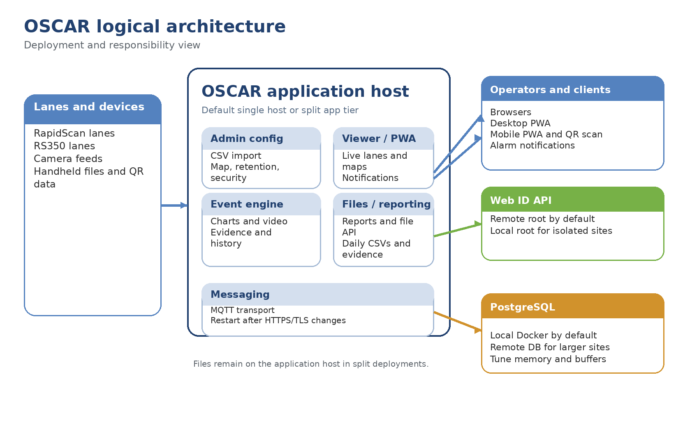

**Figure 1. Logical architecture.**

## Major components

| **Component**          | **Purpose in the system**                                                                                           | **Operational notes**                                                                                                            |
|------------------------|---------------------------------------------------------------------------------------------------------------------|----------------------------------------------------------------------------------------------------------------------------------|
| OSCAR application host | Runs the service/admin surface, hosts the viewer/PWA, processes events, stores files, and coordinates integrations. | The same host can also serve HTTPS to the viewer and can remain the file owner even when the database is moved elsewhere.        |
| PostgreSQL database    | Persists events, statuses, statistics, and related operational data.                                                | Default deployment starts locally in Docker. Larger sites can point the application to a remote database server.                 |
| File repository        | Stores daily CSV files, videos, site diagrams, reports, spreadsheet imports, and adjudication evidence.             | Stored under the node application directory in a Files area, with Daily Files called out explicitly.                             |
| Viewer and PWA clients | Provide live lane status, event tables, maps, adjudication workflows, and mobile install support.                   | The same viewer can be used in a browser, installed as a desktop PWA, or installed on a phone for notifications and QR scanning. |
| Web ID API             | Analyzes N42 files and returns isotope-oriented evidence that can be used during adjudication.                      | The root URL is configurable. A default remote root can be used, and local or offline deployment options are supported.          |
| Cambio conversion path | Transforms uploaded files into N42 so the rest of the system can work against a standard format.                    | This is especially important for offline use and for file types that are not already N42.                                        |
| MQTT service           | Supports secure messaging transport used by the application stack.                                                  | Restart after HTTPS/TLS is enabled so the service can recognize secure transport settings.                                       |
| Sensors and cameras    | Supply the live radiation and video inputs associated with lanes.                                                   | Supported inputs include Rapiscan, Aspect, RS350, and custom FFmpeg-compatible camera streams.                                   |

## Deployment patterns

| **Pattern**                    | **When to use it**                                                                     | **Characteristics**                                                                                                                                   |
|--------------------------------|----------------------------------------------------------------------------------------|-------------------------------------------------------------------------------------------------------------------------------------------------------|
| Single host                    | Default starting point and smaller sites                                               | Dockerized PostgreSQL runs locally next to the Java application. Simpler to install. Good fit for evaluation and low-to-moderate lane counts.         |
| Split application and database | Recommended once sites move past roughly 10 lanes or toward 50 lanes with many cameras | PostgreSQL is moved to a dedicated machine and tuned more aggressively. The application host keeps videos, other files, and the viewer/API functions. |
| Future hardened deployment     | Planned future architecture; not part of the v3.3.2 / 3.5 feature line                 | Security- and internationalization-driven deployment changes are intended to reduce attack surface and make the system more opinionated.              |

# 3. Installation and initial startup

Installation is intentionally simple: download a release archive, extract it, ensure Docker is installed and running, and launch the platform with the OS-specific launch-all script. The database and application come up together in the default deployment path.

## Prerequisites

| **Item**                        | **Why it matters**                                              | **Notes**                                                                                                    |
|---------------------------------|-----------------------------------------------------------------|--------------------------------------------------------------------------------------------------------------|
| Supported host OS               | The release package contains OS-specific launch scripts.        | Windows has the strongest support, although the packaging also includes scripts for other operating systems. |
| Docker                          | Required for the default local PostgreSQL deployment.           | PostgreSQL replaces the older embedded H2 option in the current release line.                                |
| Browser with PWA support        | Needed for installed desktop/mobile viewer experiences.         | Chrome-like browsers support the install flow; notifications depend on secure hosting.                       |
| Optional SSL keystore           | Needed to host the application over HTTPS.                      | The HTTPS configuration expects a keystore path, password, alias, and selected port.                         |
| Optional remote PostgreSQL host | Useful for larger sites or more robust infrastructure.          | Remote database connection parameters can be entered in the admin configuration.                             |
| Optional Web ID endpoint        | Enables automated isotope analysis for evidence and RS350 data. | A remote default root can be used, but the root URL is configurable for local or offline hosting.            |

## Startup sequence

> 1\. Download the desired release from the repository releases page and extract it to a working directory.
>
> 2\. Install Docker and verify that the Docker service is running before starting OSCAR.
>
> 3\. Run the launch-all script for the operating system in use. In the default path, the script starts PostgreSQL locally in Docker and then starts the Java application.
>
> 4\. Open the application on the configured port. Port 8282 is the baseline HTTP application port, and 8443 is a representative HTTPS configuration.
>
> 5\. Sign in with the initial admin account. The initial password is configurable before launch, but the exact shipped username and password should be verified against the release README or package contents.
>
> 6\. Before production use, change the initial admin password using the dot-prefixed settings or environment file and run the set-initial-admin-password script so the password is written in the hashed form expected by the system.

<table>
<colgroup>
<col style="width: 100%" />
</colgroup>
<thead>
<tr class="header">
<th>
<strong>Operational note</strong>

If multiple extracted versions exist on the same machine, use the stop-all script to fully stop the application and Dockerized database for the version you were running. An older running container can accidentally populate data in the wrong directory and create confusion during configuration or tuning.
</th>
</tr>
</thead>
<tbody>
</tbody>
</table>

## Ports and first-run behaviors

| **Area**                   | **Typical value or behavior**                          | **Interpretation**                                                                                                   |
|----------------------------|--------------------------------------------------------|----------------------------------------------------------------------------------------------------------------------|
| Application port           | 8282 is the baseline HTTP application port.            | Treat this as the baseline HTTP entry point unless the packaged release says otherwise.                              |
| HTTPS example              | 8443 is a representative port after SSL is configured. | This is a representative secure port, not necessarily the only supported one.                                        |
| Viewer URL                 | The viewer is served from the application root.        | Once HTTPS is enabled on the host server, the viewer comes along with it; no separate viewer deployment is required. |
| Secure messaging follow-up | MQTT must be restarted after enabling HTTPS/TLS.       | The message transport needs to recognize the secure configuration before secure client connections work correctly.   |

# 4. Administrative configuration

Most setup activity in the current release flow lives in the OSCAR service module under the services area of the admin panel. This is the primary control point for configuration, replacing more manual setup patterns from earlier phases.

To upload lanes, choose file, click upload, and then navigate to the “Sensors” tab to view and edit the loaded lanes.

## OSCAR Service Settings

| **Setting**                  | **What it controls**                                                           | How it behaves                                                                                                                                                                |
|------------------------------|--------------------------------------------------------------------------------|-------------------------------------------------------------------------------------------------------------------------------------------------------------------------------|
| Spreadsheet Config Path      | Bulk creation of lane configurations from a CSV spreadsheet file.              | Upload a CSV file that contains lane definitions. After upload, the lanes appear under the Sensors tab so operators do not have to build lane modules one at a time.          |
| Lane verification            | Per-lane review of RPM and camera details after import from spreadsheet.       | After uploading, operators can inspect and adjust the imported configuration per lane in the Sensors tab, click a lane and then under lane options verify each lane's config. |
| Site Diagram Config          | Map image placement for the viewer.                                            | Operators define lower-left and upper-right bounds, upload a site image, and the viewer overlays it on the map.                                                               |
| Video Retention              | How aggressively historical videos are trimmed.                                | A representative default trims videos to five frames after seven days.                                                                                                        |
| Web ID root URL              | Destination for automated isotope analysis requests.                           | Defaults can point to a Sandia full-spectrum Web ID service, but sites can supply a local root for isolated or offline deployments.                                           |
| Statistics publish frequency | How often counts of alarms, faults, and statuses are summarized and published. | A default of one hour works, and shorter intervals are recommended at high-volume sites so each publish window stays computationally lighter.                                 |

## Persistence, transport, and security settings

| **Setting**                | **Role in the system**                                               | **Notes**                                                                                                                            |
|----------------------------|----------------------------------------------------------------------|--------------------------------------------------------------------------------------------------------------------------------------|
| Database connection        | Points the application to the local or remote PostgreSQL instance.   | The admin panel can override the default local Docker setup so larger sites can use a dedicated database host.                       |
| PostgreSQL tuning          | Improves memory use, buffers, and cache behavior as scale increases. | The PG data directory is created after the database first runs; its config file is the place to apply performance-tuning parameters. |
| SSL / HTTPS server config  | Moves the application from HTTP to HTTPS hosting.                    | Requires a keystore file, keystore password, key alias, and chosen HTTPS port.                                                       |
| MQTT TLS alignment         | Keeps the message transport aligned with secure hosting.             | After HTTPS is enabled, restart the MQTT server so it can support secure connections over TLS.                                       |
| Role-based file API access | Controls which users may retrieve which stored file categories.      | Adjudication files are an explicit example of a file class that can be enabled or denied per role.                                   |

## Persistence (PostgreSQL) Configuration

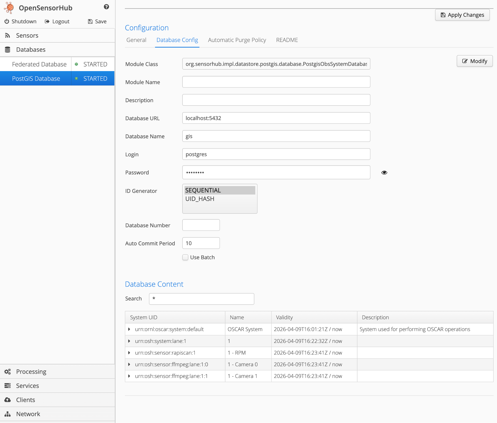

The database connection settings can be configured under the “Databases” tab, upon clicking the “PostGIS Database” module. Please consult the README for information on fine-tuning the PostgreSQL database.

## Security (HTTPS) Configuration

Under the “Network” tab, select “HTTP Server” and configure the key store path, password, and key alias for the key store containing the SSL certificate. Please check the README for generating a self-signed SSL certificate. Then select a port to serve the application over HTTPS. You may need to restart the “MQTT Server (HiveMQ)” module under the “Services” tab if live lane views / statuses do not show up.

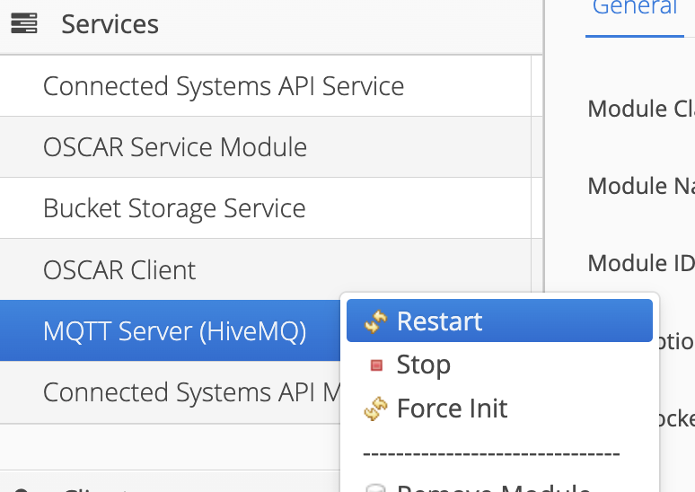

## Save and apply semantics

Lane-level changes use an Apply Changes action, while the broader admin state still needs to be saved. Leaving without saving loses lane definitions that were uploaded or edited.

A benign but annoying UI popup tied to an older Vaadin version may appear. Refresh the page if it does. This is a UI error, not a failed configuration write.

## Supporting documentation

Detailed CSV schema documentation and clearer instructions for spreadsheet formatting, camera configuration, and the password/database initialization scripts are still essential. Deployment teams should consult the packaged README or current release documentation for exact field names and examples.

# 5. Viewer and progressive web app

The viewer is the operator-facing surface of OSCAR. Its layout uses lane statuses at the top or left, an events table below, and a map on the right. The same surface can run in a browser tab or be installed as a progressive web app on desktop or mobile devices.

## Viewer capabilities

| **Capability**         | Behavior                                                                                                             | **Operational value**                                                                               |
|------------------------|----------------------------------------------------------------------------------------------------------------------|-----------------------------------------------------------------------------------------------------|
| PWA installation       | The browser can install the viewer directly from the address bar or browser menu.                                    | Creates a more app-like operator experience on desktop and mobile without a separate native client. |
| Lane status awareness  | Hovering a lane status reveals which node the lane belongs to, and lane tiles are sorted alphanumerically.           | Useful when one viewer aggregates multiple nodes and needs deterministic ordering.                  |
| Event table pagination | The system now loads 15 events at a time rather than loading the entire event history in one pass.                   | This significantly improves responsiveness at higher event volumes.                                 |
| Event filtering        | Users can filter by start time, end time, and status. An isotope field for RS350-specific filtering is still absent. | Makes large event sets easier to search while highlighting one area still needing UI expansion.     |
| Lane detail pages      | Lane detail pages show charts and associated camera video for the selected lane.                                     | Supports rapid operator review of live behavior and alarm context.                                  |
| Push notifications     | The viewer and PWA can emit alarm notifications and deep-link the user back into the event detail page.              | Lets staff step away from the active screen without losing awareness of alarms.                     |

## Viewer Usage

- The viewer is located at the root of the \<IP:PORT\>

- The dashboard for the OSCAR Viewer contains 3 different viewpoints

  - Lane Status - List of alphanumeric Lanes

  - Event Table - Table of unadjudicated occupancies from each lane

## Map/ Event Preview

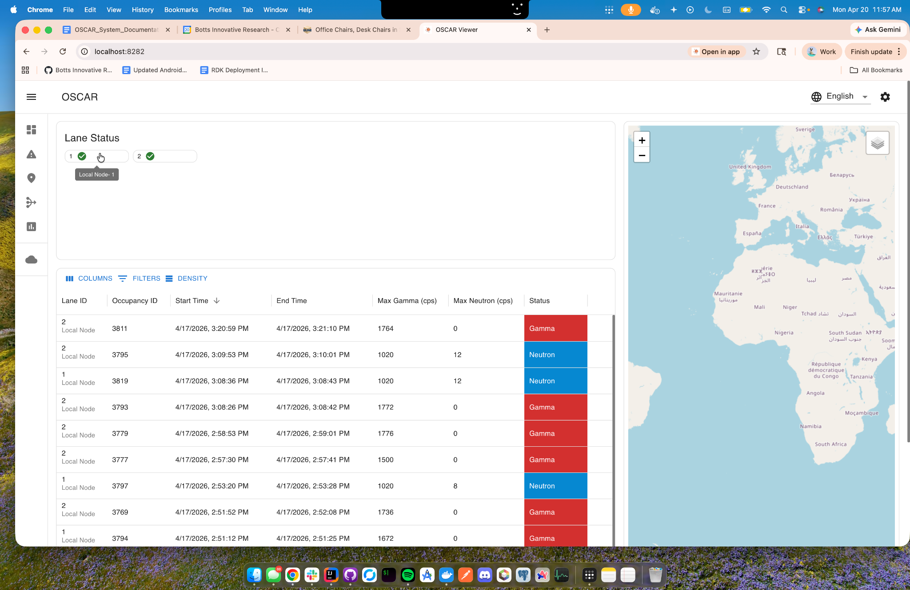

- Hovering over an item in the Lane Status will show the Server’s name

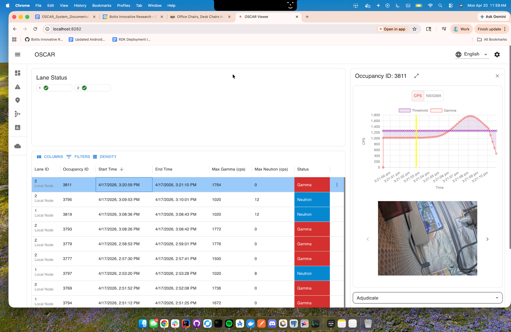

- Clicking on an event in the table, will open an event preview on the right side of the screen. To expand into the Event Details page click the expand icon in the event preview, or simply double tap the event.

- To adjudicate an Alarm on the dashboard page, first click on an event to open the Event Preview. Then fill out the form by selecting the Adjudication code, if it needs a secondary inspection, and any notes that are needed. Then click submit to close the event and remove it from the table.

## HTTPS is part of the PWA story

Secure hosting is part of the mobile experience. Most browsers and devices will not allow push notifications from a non-secure origin, so HTTPS is not just a security preference; it is a functional prerequisite for the notification workflow. Once the host server is configured for HTTPS, the viewer itself is available over HTTPS without a separate web-tier deployment.

- To install OSCAR Viewer app as a PWA, open the viewer in the browser \<IP:PORT\> and then click the install button, then click install.

## Mobile use and QR code capture

A phone can install the same PWA and use the device camera or QR scanner to capture evidence from handheld detectors. Officers in the field can use the mobile PWA to scan a detector QR code and push that evidence into the event workflow. Tailscale is one possible network path to reach the secure host, but the underlying requirement is simply secure reachability to the OSCAR server.

- After clicking an event in the table and opening the Event Details. Scroll to the ‘Evidence Collection’ to begin the adjudication process!

- Here we are able to upload files directly, or scan QR codes and mark them as WebId to use as evidence in our Adjudication.

- After successful upload of WebId, we can add it into our adjudication.

- Fill out the remaining parts of the form and click submit! A dialog will appear asking you to double check your submission before confirming.

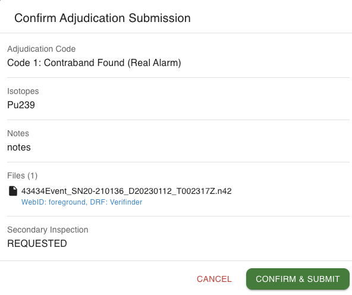

# 6. Sensor, camera, and service integrations

OSCAR integrates three broad categories of lane input: fixed lane detectors such as Rapiscan, mobile detector lanes built around the RS350, and associated video streams for situational context. External analysis and format-conversion services round out the integration story.

## Rapiscan and RS350 compared

| **Aspect**              | **Rapiscan lane**                                                                                                            | **RS350 lane**                                                                                                                                                                |
|-------------------------|------------------------------------------------------------------------------------------------------------------------------|-------------------------------------------------------------------------------------------------------------------------------------------------------------------------------|
| Lane role               | Represents a fixed scan lane in the site configuration.                                                                      | Represents a mobile or backpack-style detector lane added in the newer release.                                                                                               |
| Viewer presentation     | Shows event charts and associated video during the event.                                                                    | Shows foreground linear and compressed spectrum data, plus associated video. Background behavior depends on how frequently the RS350 produces background in its current mode. |
| Automated evidence path | Rapiscan events do not currently emphasize an automatic Web ID capture path.                                                 | The system automatically captures an N42 artifact during an alarm and submits it to Web ID without extra user input.                                                          |
| Adjudication evidence   | Operators can manually upload files, mark detector response function, and request Web ID analysis before final adjudication. | Operators can directly use the auto-generated Web ID result tied to the event as adjudication evidence.                                                                       |
| Current UI gaps         | No major Rapiscan-specific UI limitation is called out beyond general export and analysis feature gaps.                      | The backend stores useful isotope-related data, but some of it is not yet surfaced directly in the viewer, especially when Web ID is unavailable.                             |

## Custom camera configuration

Camera setup uses FFmpeg-compatible streams. The admin flow allows a custom camera definition so operators can provide host and path data for streams recognized by FFmpeg, including RTSP-style inputs. This path is intended to be general-purpose rather than restricted to one camera vendor.

<table>
<colgroup>
<col style="width: 100%" />
</colgroup>
<thead>
<tr class="header">
<th>
Custom camera integration note

Custom camera streams that require a host-plus-port value and a trailing slash in the stream path need validation. Plain RTSP streams should work, but the custom camera input form may have edge cases around host:port plus trailing slash formatting. Treat this pattern as an item to validate in test before field deployment.
</th>
</tr>
</thead>
<tbody>
</tbody>
</table>

## Web ID integration

Web ID is the analysis service used to turn uploaded or automatically captured N42 content into useful isotope-oriented evidence. In the RS350 flow, one of the N42 outputs produced during the alarm is automatically submitted and a result appears on the event. In manual evidence flows, operators can upload a file, request Web ID analysis, and then use the selected result to populate the adjudication form.

Web ID analyses can expose isotope names, gamma counts, and neutron counts, although the UI examples emphasize isotope identification and evidence selection more than count-detail presentation.

## Cambio conversion path

Cambio exists to normalize uploaded files into N42 before the rest of the pipeline sees them. This design keeps the downstream analysis and visualization path centered on a standard format. In practical terms, an uploaded SPE file can be converted to N42, visualized with the same charting logic used elsewhere, and then either sent onward to Web ID or retained for offline review.

# 7. Event, evidence, and adjudication workflow

OSCAR does not only log alarms; it organizes the full chain from lane event to evidence collection to adjudication history and report output.

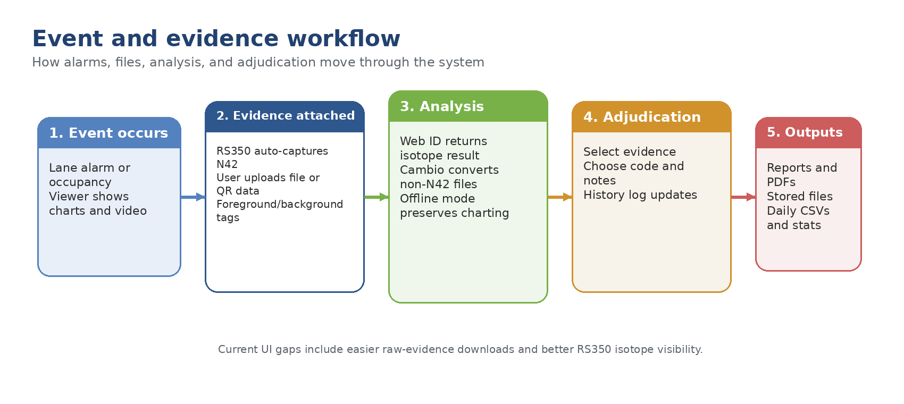

**Figure 2. Event, evidence, and adjudication workflow.**

## Detailed event flow

> 1\. A lane event or alarm appears in the viewer, where operators can open event details and see charts and video tied to the event window.
>
> 2\. For RS350 alarms, the system automatically captures a relevant N42 artifact and submits it to Web ID. The resulting isotope identification can then be selected as adjudication evidence.
>
> 3\. For manually handled events, users can upload files from detectors, tag them as foreground or background, identify the detector response function, and optionally synthesize background before running the Web ID path.
>
> 4\. The resulting evidence is shown in the event detail table and can drive the adjudication form rather than forcing the operator to retype isotope names or infer them from scratch.
>
> 5\. Adjudication history is recorded on the event, allowing the system to preserve the evolving investigation trail instead of only the final label.

## Evidence types

| **Evidence source**     | **How it enters OSCAR**                                                                            | Notes                                                                                                                                               |
|-------------------------|----------------------------------------------------------------------------------------------------|-----------------------------------------------------------------------------------------------------------------------------------------------------|
| RS350 alarm N42         | Automatically captured by the backend during an RS350 alarm and submitted to Web ID.               | Useful immediately for adjudication. The backend retains the N42 content, but the UI does not yet expose all desired download and metadata options. |
| Uploaded detector files | Manually uploaded in the event evidence area.                                                      | Can be classified with detector response information and converted to N42 if necessary.                                                             |
| QR code data            | Uploaded from handheld monitors such as Verifinder, either through the UI or mobile scanning flow. | Can be tagged as foreground, background, or both, and associated with the source detector.                                                          |
| Web ID result objects   | Created either automatically from RS350 alarms or manually from uploaded evidence.                 | Selectable as adjudication evidence and usable to prefill isotope details in the adjudication form.                                                 |
| Videos                  | Captured alongside lane activity and presented in event detail views.                              | Subject to the configured retention and trimming policy.                                                                                            |

## Offline behavior

When a site has no Internet or no Web ID reachability, the current UI does not fall back to displaying the detector-identified isotope in the visible event details, even though relevant isotope information is stored by the backend. What still works is the file normalization path: uploaded files can be converted to N42 through Cambio, charted, and retained as evidence. Offline mode preserves the data and visualization workflow, but not the full richness of the Web ID-driven UI.

<table>
<colgroup>
<col style="width: 100%" />
</colgroup>
<thead>
<tr class="header">
<th>
Export and download status

OSCAR includes a PDF export path and some direct file downloads from adjudication records. Easier downloads of the original N42 submitted to Web ID and a single ZIP package containing all raw evidence associated with an event remain desired convenience features rather than completed capabilities.
</th>
</tr>
</thead>
<tbody>
</tbody>
</table>

# 8. Reporting, files, and data lifecycle

Beyond the live event workflow, OSCAR maintains a file and reporting layer that gives operators durable outputs and historical records. The system includes daily CSV generation, site and event reports, stored videos, and per-role access control over file retrieval.

## Statistics and reporting surfaces

| **Area**         | **What users can do**                                                                             | Notes                                                                                                                                |
|------------------|---------------------------------------------------------------------------------------------------|--------------------------------------------------------------------------------------------------------------------------------------|
| Statistics page  | Review statistics by lane and node, sort results, filter by time period, and refresh the counts.  | The page aggregates counts of alarms, faults, and statuses. Per-node lists are part of the model even when only one node is present. |
| Report generator | Generate site-wide, per-lane, per-lane adjudication, or event reports for a selected time period. | Generated reports can be downloaded immediately or retrieved later from the file system.                                             |
| Daily files      | Consume machine-generated daily CSV outputs for each lane.                                        | Each lane produces a daily file at midnight in a basic CSV format similar to Rapiscan daily files.                                   |

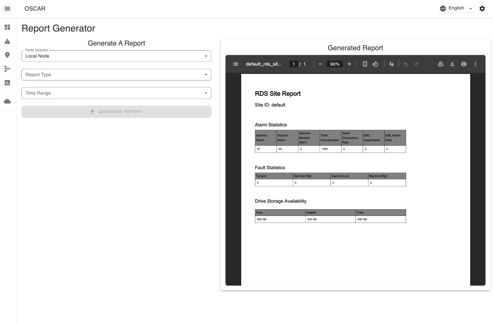

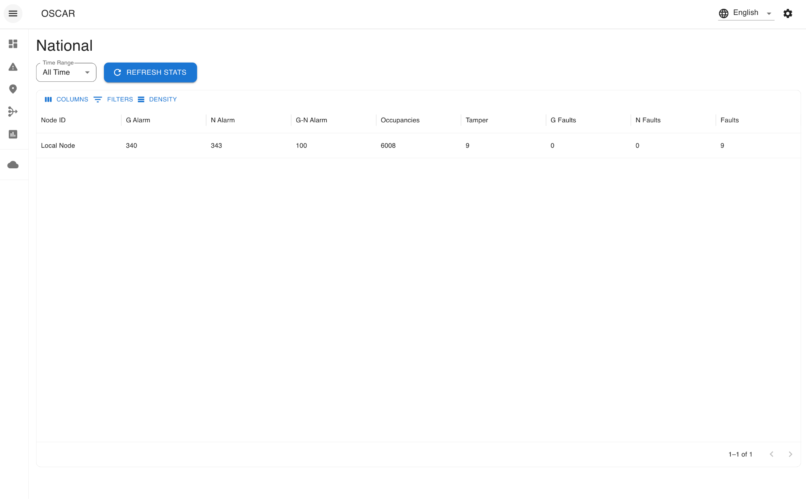

## File-system areas

| **Location or area**       | **Contents**                                                                                                     | **Notes**                                                                                                         |
|----------------------------|------------------------------------------------------------------------------------------------------------------|-------------------------------------------------------------------------------------------------------------------|
| Node application directory | The root working area that contains the running application and supporting data folders.                         | Often referred to as the node OSCAR directory.                                                                    |
| Files                      | Shared repository for reports, uploaded evidence, site maps, spreadsheet imports, videos, and related artifacts. | The file API exposes this content subject to user-role permissions.                                               |
| Files / Daily Files        | Per-lane daily CSV exports generated each midnight.                                                              | The most explicitly named subfolder in the file repository.                                                       |
| PG data directory          | PostgreSQL runtime data and configuration used for tuning.                                                       | Created the first time the database runs; tuning guidance was expected to target the Postgres config stored here. |

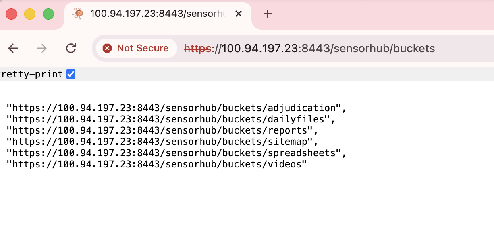

Navigating to /sensorhub/buckets will show the different “buckets” or application directories. Files can be accessed via this API or directly via the filesystem.

## Retention and file access control

Video retention is configurable and can aggressively reduce old videos to a small frame sample after a selected number of days. This is important because the file repository carries both operational evidence and long-lived administrative outputs. File retrieval is not uniformly open to every user: roles can be configured to deny access to certain file categories, with adjudication files used as an explicit example.

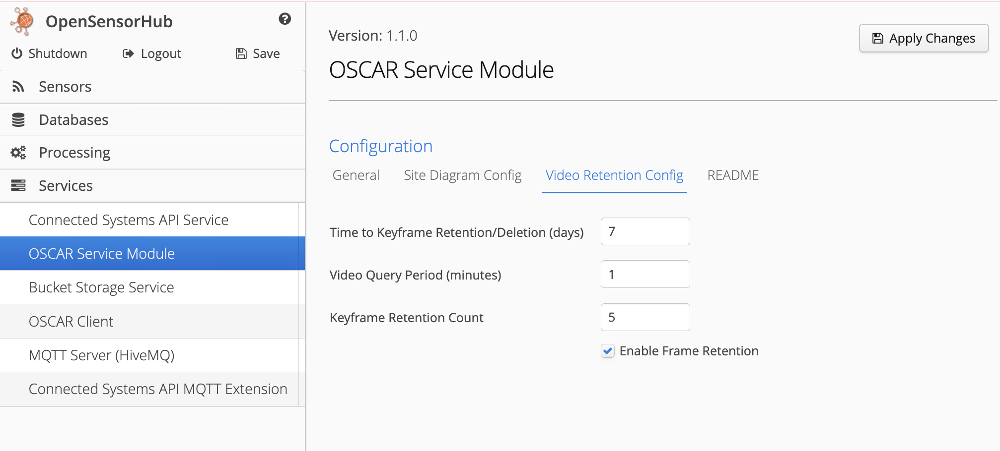

Configuration of video retention lives in the “OSCAR Service Module.”

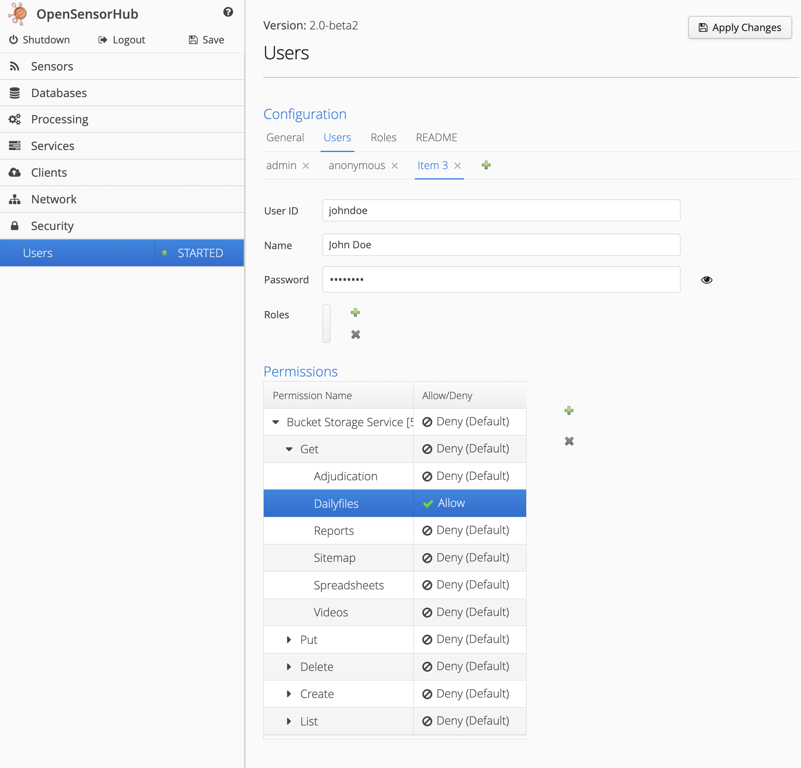

Configuration of additional users / permissions exists under the “Security” tab. Users can be configured with fine-grained permissions to access / write to the system.

# 9. Performance, scale, and deployment guidance

Default deployment begins to strain as lane counts, event volume, and camera counts increase. The following guidance is useful for planning, even though it is not a formal support limit.

| **Scenario**                      | Guidance                                                                                   | **Why it matters**                                                                                                                                         |
|-----------------------------------|--------------------------------------------------------------------------------------------|------------------------------------------------------------------------------------------------------------------------------------------------------------|
| More than about 10 lanes          | Start thinking about PostgreSQL optimization and adding RAM.                               | Default database settings may become inefficient once event and camera volume grow past small deployments.                                                 |
| Roughly 50 lanes and many cameras | Move PostgreSQL to a dedicated machine and tune memory, cache, and buffer settings.        | This is the point where split deployment becomes the sensible architecture.                                                                                |
| High event volume                 | Lower the statistics publish interval so each publish window covers fewer records.         | Statistics publishing is efficient because it only counts changes since the previous publish, but large windows still increase the amount of work per run. |
| Heavy viewer histories            | Rely on pagination rather than loading the full event table.                               | Sites with about 200,000 events across 50 lanes can bog the viewer down if the full table is loaded at once.                                               |
| Large camera counts               | Be conservative about video resolution and frame rate when planning for 50 to 100 cameras. | 1080p can be acceptable for small systems but is likely too heavy when multiplied across very large deployments.                                           |

## Camera profile planning

A practical target profile for scaled deployments is 640x480 at about 5 frames per second, while 1080p may be acceptable on smaller systems. Camera settings should be chosen with total system scale in mind. For a 50-lane or 100-camera target, the aggregate cost of 1080p video is likely excessive.

## What stays where in a split deployment

When PostgreSQL is moved off the application host, videos and the other stored files remain on the application server. In practice, that means the application tier continues to own the file system while the database tier handles relational persistence. This is important for storage planning, backups, and role-based file retrieval.

# 10. Upgrade, versioning, and release context

Versioning follows semantic-versioning logic. Patch updates are expected to remain compatible with the existing database and configuration, while minor-version jumps may require a fresh database because the schema can change in incompatible ways. Configuration-file translation and database migration scripts are likely to become necessary if the platform continues to evolve quickly.

| **Topic**                | Current guidance                                                                                                                                                   |
|--------------------------|--------------------------------------------------------------------------------------------------------------------------------------------------------------------|
| Patch updates            | Expected to be backward compatible with the existing database and config.json.                                                                                     |
| Minor updates            | May introduce incompatible database-schema changes and may require a fresh database unless migration logic is added.                                               |
| Configuration migrations | A future script that translates old config.json values into a new schema is a likely requirement.                                                                  |
| Database migrations      | The same future migration path should ideally cover database changes as well as configuration changes.                                                             |
| Release baseline         | v3.3.2 is the feature-complete build expected to become 3.5 after an internal test cycle, after which only backward-compatible bug fixes are expected for a while. |

<table>
<colgroup>
<col style="width: 100%" />
</colgroup>
<thead>
<tr class="header">
<th>
Version note

The release guidance above reflects the v3.3.2 / 3.5 pause-point feature line and should not be treated as the current latest version without checking the repository or release notes.
</th>
</tr>
</thead>
<tbody>
</tbody>
</table>

## Security and internationalization roadmap

The current feature line is flexible and easy to place on a Windows laptop, Mac laptop, or other ad hoc environment. A future branch focuses on stronger security posture and internationalization, with a more opinionated deployment model and reduced attack surface. The current line includes only basic translation support, and the broader internationalization effort is not part of the 3.5 pause-point build.

# 11. Known gaps, open issues, and recommended follow-up

This section captures known gaps and enhancement ideas so they are not confused with already-shipped capability.

| **Area**                      | Current state                                                                                                    | **Recommended follow-up**                                                                                   |
|-------------------------------|------------------------------------------------------------------------------------------------------------------|-------------------------------------------------------------------------------------------------------------|
| CSV import documentation      | The spreadsheet schema and exact formatting rules need clearer documentation.                                    | Publish the schema, an example file, and field-by-field definitions next to the release assets.             |
| Custom camera URI handling    | Custom camera URI patterns that require host, port, and trailing-slash stream paths need validation.             | Reproduce with a representative virtual-camera tool and document the accepted host/path pattern.            |
| RS350 isotope display         | Useful isotope data is captured by the backend but not always shown directly in the viewer, especially offline.  | Expose detector-identified isotope fields in the event details UI and the filter surface.                   |
| Raw evidence download         | Direct download of the exact N42 and other files associated with the event is still needed.                      | Add per-evidence download actions near the relevant evidence rows.                                          |
| Evidence bundle export        | A ZIP of all raw evidence is still needed in addition to existing PDF-oriented export paths.                     | Create an event export bundle that includes the PDF summary plus raw artifacts.                             |
| Spectrum focus tools          | A time-profile view that isolates the most relevant portion of a long measurement would improve evidence review. | Add linked time-series and spectral sub-selection to the evidence review UI.                                |
| Migration tooling             | Future config and database changes will become difficult to manage manually.                                     | Plan paired migration scripts for config.json and the database before the next major architectural shift.   |
| UI error handling             | An older Vaadin-related popup still appears and is currently handled by refresh.                                 | Fix or suppress the benign popup so operators do not confuse it with configuration failure.                 |
| Internationalization coverage | Only limited translation support is present in the current feature line.                                         | Merge or reimplement the broader language coverage once the future branch becomes the active platform line. |

# Appendix A. Deployment checklist

> 1\. Install Docker and verify that the service is running on the host before launch.
>
> 2\. Extract the chosen OSCAR release and start it with the OS-specific launch-all script.
>
> 3\. Change the initial admin password using the package-provided settings file and password-initialization script before production use.
>
> 4\. Upload the lane CSV, then verify lane options such as detector type, RS350 assignments, and camera settings.
>
> 5\. Upload the site diagram and define its lower-left and upper-right map bounds.
>
> 6\. Set the Web ID root URL, statistics publish interval, video retention policy, and any remote database parameters.
>
> 7\. Enable HTTPS with a keystore, save the configuration, and restart MQTT so secure messaging picks up the TLS settings.
>
> 8\. Review role and file-access settings so users only see the file classes they are meant to retrieve.
>
> 9\. Install the viewer as a PWA where appropriate, then test push notifications, event viewing, file uploads, and QR-code capture.
>
> 10\. Generate at least one report, verify that files land in the expected file-system area, and confirm daily CSV generation during operational testing.

# Appendix B. Glossary

| **Term**     | **Meaning in this document**                                                                                       |
|--------------|--------------------------------------------------------------------------------------------------------------------|
| Lane         | An operational sensing unit configured in OSCAR, typically combining detector inputs and related cameras.          |
| Node         | A server instance that exposes one or more lanes to the viewer and reporting surfaces.                             |
| Event        | A time-bounded occurrence, often alarm-oriented, that can hold spectra, video, evidence, and adjudication history. |
| Occupancy    | The passage or time window associated with a lane event and its supporting charts/video.                           |
| Adjudication | The human review process that evaluates evidence and records an event outcome, codes, notes, and follow-up action. |
| Web ID       | The analysis service used to interpret N42 content and produce isotope-oriented evidence.                          |
| N42          | A standard file format used to exchange radiation measurement and spectral information.                            |
| Cambio       | The conversion path used by OSCAR to transform uploaded files into N42 before analysis and display.                |
| PWA          | Progressive web app. The installable version of the viewer for desktop or mobile use.                              |
| RS350        | A supported backpack-style mobile detector lane type.                                                              |

